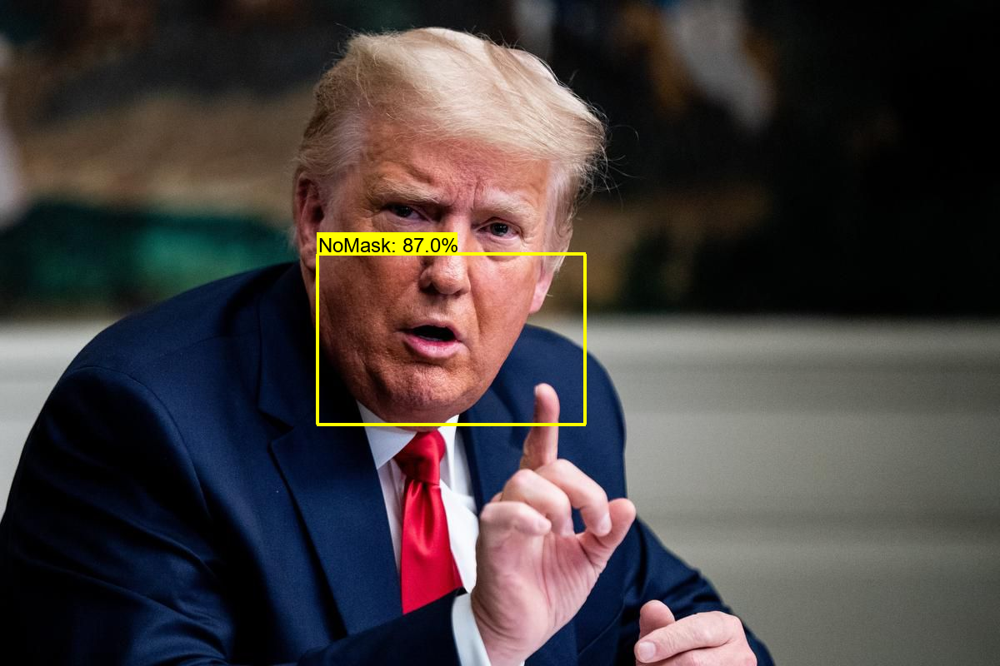

# Mask Detector
We are going through difficult times right now where it is vital to wear a mask to ensure the safety of yourself as well as others. I created a simple and lightweight object detection program that can detect if you are wearing a mask or not. Utilized the object detection API and tensorflow framework to train the SSD-mobile net neural network consisting of 300+ images to come up with these detections through Python. Model has a accuracy of 92% based on testing data. Take a look at some examples down below :
## Mask Class

  
   

## NoMask Class

  
   

