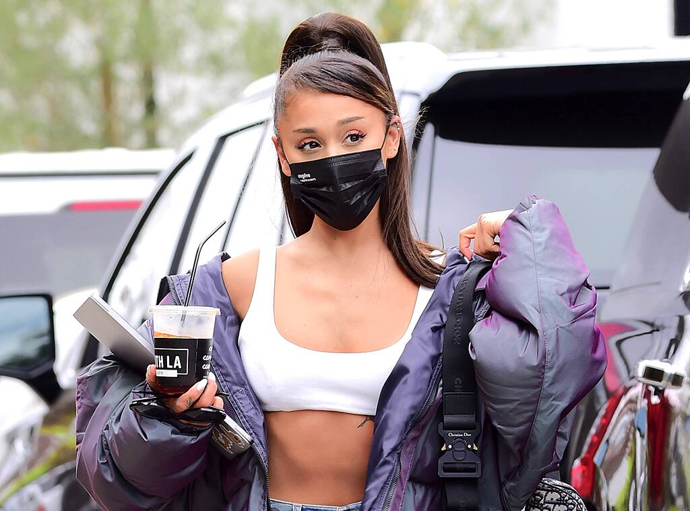
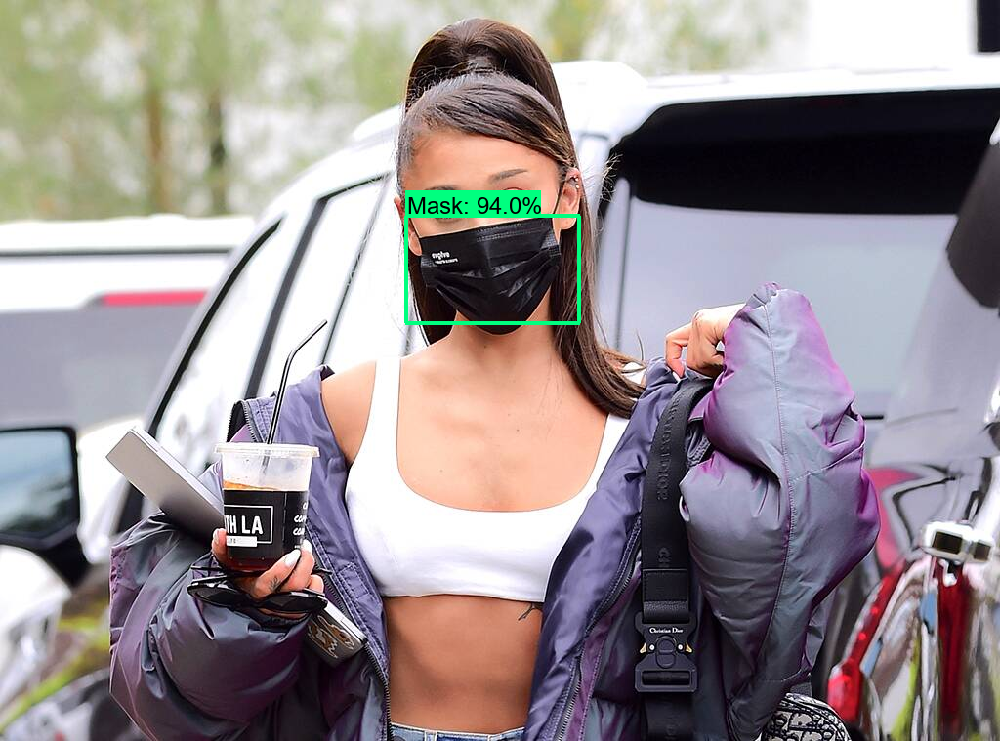

# Mask Detector
We are going through difficult times right now where it is vital to wear a mask to ensure the safety of yourself as well as others. I created a simple object detection program that can detect if you are wearing a mask or not.

  
   

